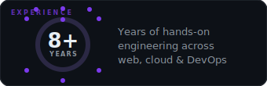

<div align="center">


[](https://git.io/typing-svg)

</div>

---

## 👋 Hey there! I'm Roshan

<div align="center">

<picture>
  <source media="(prefers-color-scheme: dark)"  srcset="https://raw.githubusercontent.com/roshanb08/roshanb08/output/github-snake-dark.svg"/>
  <source media="(prefers-color-scheme: light)" srcset="https://raw.githubusercontent.com/roshanb08/roshanb08/output/github-snake.svg"/>
  
</picture>

</div>

<table align="center" border="0" cellspacing="0" cellpadding="6">
<tr>
  <td align="center" valign="middle">
    
  </td>
  <td></td>
</tr>
<tr>
  <td></td>
  <td></td>
</tr>
</table>

---

## 🛠️ The Stack That Pays My Bills

<div align="center">

### Backend & Languages


### Frontend


### DevOps & Cloud


### Databases


</div>

---

## 📊 GitHub Stats *(Yes, I actually commit)*

<div align="center">


</div>

<div align="center">


</div>

---

## 🎯 What I Actually Do

```yaml
day_in_the_life:
  morning:
    - Coffee ☕
    - Check that the cluster didn't explode overnight
    - Review PRs (and resist the urge to rewrite everything)

  afternoon:
    - Code review + mentoring junior devs
    - Push features to production (optimistically)
    - Watch CI/CD pipelines turn green 💚

  evening:
    - Kubernetes decided to have a personality today 😅
    - Fix what the morning deployment broke
    - More coffee ☕☕
```

---

## 📈 Contribution Graph

<div align="center">

[](https://github.com/ashutosh00710/github-readme-activity-graph)

</div>

---

## 🤝 Let's Connect

<div align="center">

[](https://roshanbhandari.com)
[](https://www.linkedin.com/in/roshan-bhandari-81583a152/)
[](mailto:roshanb.mail@gmail.com)
[](https://wa.me/9779867306575)

</div>

---

<div align="center">

### ⚡ Fun Facts

> 🧠 *I debug by staring intensely at the screen until it feels guilty and fixes itself.*

> ☸️ *My Kubernetes cluster has more uptime than my sleep schedule.*

> 🌏 *Built production systems used by airports, telecoms, and banks — yes, it's terrifying.*

> 🦾 *8 years of experience means 8 years of "it works on my machine".*

---


</div>
